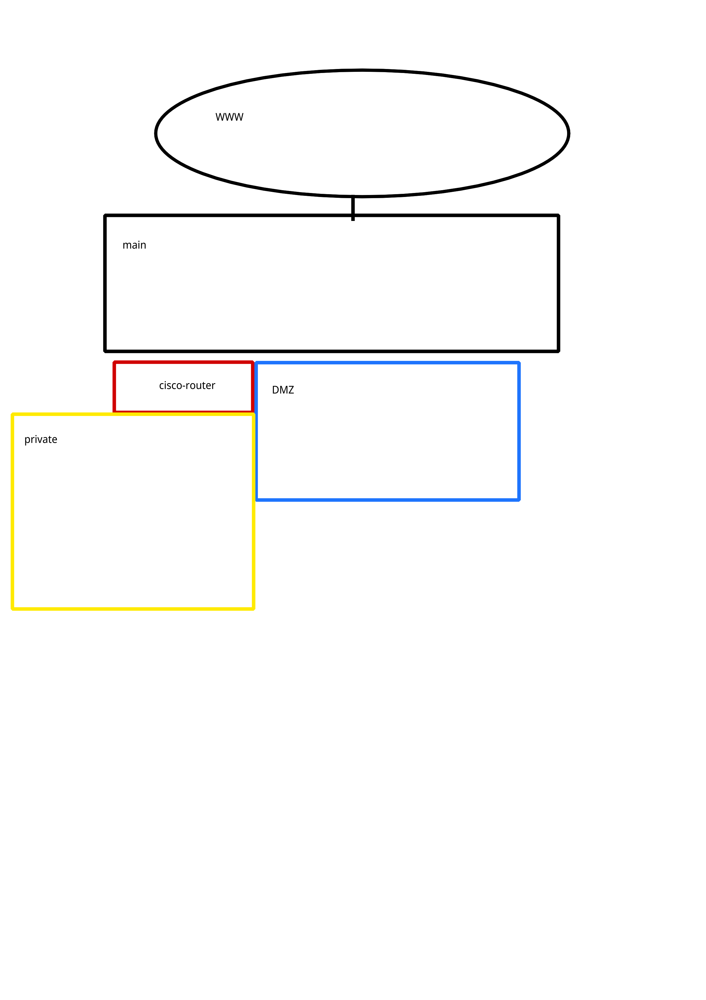

# 自宅NWにあらたに実験NWをつくる

現状メイン、サブというnetworkがある。

メインの下にサブのゲートウェイがある。

実験NWもメインの下に配置する予定。

なお、ゲートウェイはcisco 1812J

## 想定実現方法(画像)

## 現状

- private
  - dhcpは設定してる。
  - dhcpからipは取得できてる。
  - ciscoとの通信はできてない

## 想定実現方法(文章)
